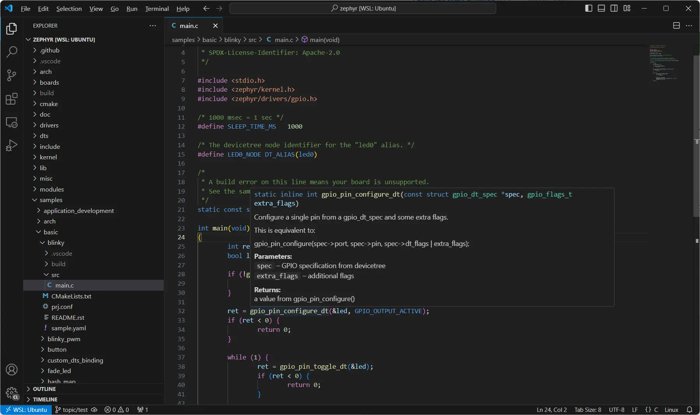

Getting Started
***************

This module can be used to generate a Visual Studio Code (VS Code) workspace to help get started with basic Zephyr development in VS Code.

#. Download and install `VS Code`_.

#. Follow the `Zephyr Project Getting Started Guide`_ to get the Zephyr source code and set up a command-line development environment. Make sure you can successfully build the Blinky sample as described in that guide.

#. Fetch this module by adding the module's example manifest to the submanifests directory and doing ``west update``:

   **Ubuntu**

   .. code-block:: bash

      cd ~/zephyrproject/zephyr/submanifests
      wget https://raw.githubusercontent.com/hakanjansson/zephyr-vscode/refs/heads/main/submanifest/hakanjansson.yaml
      west update

   **Windows**

   .. code-block:: bash

      cd %HOMEPATH%\zephyrproject\zephyr\submanifests
      wget https://raw.githubusercontent.com/hakanjansson/zephyr-vscode/refs/heads/main/submanifest/hakanjansson.yaml
      west update

#. Generate the VS Code workspace:

   **Ubuntu**

   .. code-block:: bash

      cd ~/zephyrproject/zephyr
      west build -p always -b <your-board-name> samples/basic/blinky -- -DCONFIG_VSCODE_WORKSPACE=y

   **Windows**

   .. code-block:: bash

      cd %HOMEPATH%\zephyrproject\zephyr
      west build -p always -b <your-board-name> samples/basic/blinky -- -DCONFIG_VSCODE_WORKSPACE=y

#. Start VS Code, select ``File->Open Folder...`` and select the folder ``~/zephyrproject/zephyr``

#. Build Blinky sample from VS Code by selecting ``Terminal->Run Task...`` and then selecting the task ``West Build``. (Alternatively use the keyboard shortcut ``CTRL+SHIFT+B``.)

#. Flash the Blinky sample from VS Code by selecting ``Terminal->Run Task...`` and then selecting the task ``West Flash``.

#. Get started with `debugging`_.

Description
************

Specifying ``CONFIG_VSCODE_WORKSPACE=y`` will generate a VS Code workspace during the configuration phase of the Zephyr build. By default, the workspace will be based on the templates available in the ``templates`` folder. The default generated workspace configures the VS Code C/C++ extension to provide IntelliSense using a ``compile_commands.json`` generated by CMake. This is essentially automating some of the steps in the Zephyr 3.7 documentation's `VS Code guide`_.

The provided template ``zephyr.code-workspace`` additionally provides tasks for ``west build`` and ``west flash``.

Board specific templates can be added to provide additional board specific items. For example, the provided ``cyw920829m2evk_02.code-workspace`` provides board specific launch configurations for debugging on the ``cyw920829m2evk_02`` board.

The workspace generation uses CMake transformations to replace variables of the form ``@VAR@`` in the templates with actual values from the build system. See the provided template files for examples.

If a VS Code workspace already exists, then the generation will merge the newly generated elements into the existing workspace. This will be done as a recursive merge of JSON objects. Any new elements will simply be added to the existing workspace. Any existing, uniquely identifiable, leaf node element will be updated with the new generated value. Please note that elements in JSON arrays are currently not considered uniquely identifiable, neither by position in array nor by any keys such as "label" or "name". This can, for example, cause some confusing duplication of tasks with the same name. Any identical elements in the arrays will not be duplicated, though.

The available templates have been created so that the fields typically changing have been stored in configuration variables in ``settings``. That way, the JSON task definitions can use the configuration variables and do not need to change. Since the task definitions are not changing, it is safe to simply regenerate the workspace if required without causing any duplication of the tasks from the templates.

The CMake API function that reads the JSON templates and merges them into the workspace is exposed. It can be used from applications to add additional items to the workspace. This is the function description from the CMake file: 

.. code-block:: cmake

   # Reads JSON file "filename" and evaluates any variable references. File is expected to follow the
   # VS Code multi-root workspace file schema. Merges content into the generated workspace.
   function(vscode_workspace_add_json_file filename)

Kconfig Options
***************

.. code-block:: kconfig

    config VSCODE_WORKSPACE
    	bool "Generate Visual Studio Code workspace"
    	default n
    	help
    	  Generate Visual Studio Code workspace. If a workspace already exists, the
    	  existing workspace is modified in place.

    config VSCODE_WORKSPACE_TEMPLATE
    	bool "Include workspace template"
    	default y
    	depends on VSCODE_WORKSPACE
    	help
    	  Include elements from generic, as wells as any board specific, workspace
    	  templates when generating workspace.

    config VSCODE_WORKSPACE_MULTIROOT
    	bool "Generate multi-root workspace file"
    	default n
    	imply VSCODE_WORKSPACE
    	help
    	  Generate multi-root workspace file. The default is 'n', which will create
    	  a single-root workspace in a .vscode subfolder.

    config VSCODE_WORKSPACE_LOCATION
    	string "Location of workspace"
    	default "."
    	depends on VSCODE_WORKSPACE
    	help
    	  Path to the directory in which the .vscode folder or the multi-root
    	  workspace file resides. If not specified, the workspace will be created
    	  in the current working directory.

    config VSCODE_WORKSPACE_FILENAME
    	string "File name of workspace file"
    	default "$(shell, $(PYTHON_EXECUTABLE) $(ZEPHYR_VSCODE_MODULE_DIR)/scripts/workspace_name.py)"
    	depends on VSCODE_WORKSPACE && VSCODE_WORKSPACE_MULTIROOT
    	help
    	  File name of the multi-root workspace file.

Credits
*******

Inspired by the talk `Zephyr & Visual Studio Code: How to Develop Zephyr Apps with a Modern, Visual IDE <eoss_talk_>`_ at EOSS 2023.

.. _VS Code:
   https://code.visualstudio.com/download

.. _Zephyr Project Getting Started Guide:
   https://docs.zephyrproject.org/latest/develop/getting_started/index.html

.. _VS Code guide:
   https://docs.zephyrproject.org/3.7.0/develop/tools/vscode.html

.. _eoss_talk:
   https://youtu.be/IKNHPmG-Qxo

.. _debugging:
   debugging.rst
