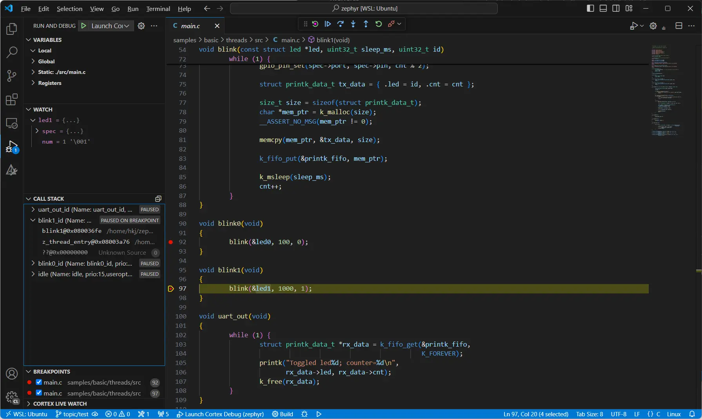

Debugging
*********

The provided template ``zephyr.code-workspace`` contains a launch configuration ``Launch Cortex Debug`` for debugging on ARM Cortex-M targets. The launch configuration uses the VS Code extension `Cortex Debug`_ and the ``west debugserver`` command.

Quick Start
===========

#. Build the ``threads`` sample application for debugging and generate VS Code workspace.

   **Ubuntu**

   .. code-block:: bash

      cd ~/zephyrproject/zephyr
      west build -p always -b <your-board-name> samples/basic/threads -- -DCONFIG_DEBUG_OPTIMIZATIONS=y -DCONFIG_DEBUG_THREAD_INFO=y -DCONFIG_VSCODE_WORKSPACE=y

   **Windows**

   .. code-block:: bash

      cd %HOMEPATH%\zephyrproject\zephyr
      west build -p always -b <your-board-name> samples/basic/threads -- -DCONFIG_DEBUG_OPTIMIZATIONS=y -DCONFIG_DEBUG_THREAD_INFO=y -DCONFIG_VSCODE_WORKSPACE=y

#. Start VS Code, select ``File->Open Folder...`` and select the folder ``~/zephyrproject/zephyr``.

#. Open the file ``samples/threads/src/main.c`` from the VS Code Eplorer view.

#. Locate the functions ``blink0`` and ``blink1``, click in the margin to add a breakpoint within each function.

#. Start debugging by selecting ``Run->Start Debugging``. (Alternatively use the keyboard shortcut ``F5``.)

#. The program execution will halt at the default main(). Press ``Continue`` on the debug toolbar, or press ``F5``, to continue execution.

#. The program execution will now halt at the breakpoint in ``blink0``. Press ``F5`` to continue.

#. The program execution will now halt at the breakpoint in ``blink1``. Look at the call stack panel and notice that the call stacks for all three threads created by the application, plus the idle thread, can be seen.

.. _Cortex Debug:
   https://github.com/Marus/cortex-debug
